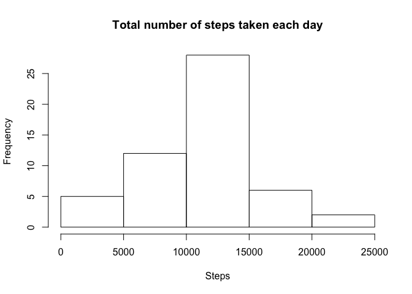
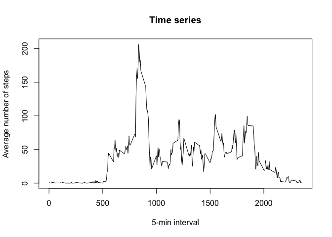
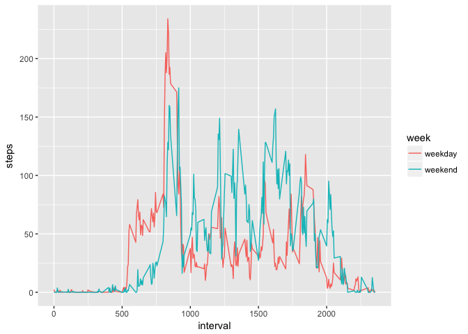

# Reproducible Research: Peer Assessment 1


## Loading and preprocessing the data

The following R packages are preloaded in order to start working on the assignment:
- graphics
- grDevices
- knitr
- methods
- stats
- utils

Load data in a dataframe for first inspection


```r
activity_data_raw <- read.csv("activity.csv")
str(activity_data_raw)
```

```
## 'data.frame':	17568 obs. of  3 variables:
##  $ steps   : int  NA NA NA NA NA NA NA NA NA NA ...
##  $ date    : Factor w/ 61 levels "2012-10-01","2012-10-02",..: 1 1 1 1 1 1 1 1 1 1 ...
##  $ interval: int  0 5 10 15 20 25 30 35 40 45 ...
```

First inspection shows the variable date as character, a conversion to date class is needed for statistical calculations 


```r
activity_data_raw$date <- as.Date(activity_data_raw$date)
str(activity_data_raw)
```

```
## 'data.frame':	17568 obs. of  3 variables:
##  $ steps   : int  NA NA NA NA NA NA NA NA NA NA ...
##  $ date    : Date, format: "2012-10-01" "2012-10-01" ...
##  $ interval: int  0 5 10 15 20 25 30 35 40 45 ...
```

## What is mean total number of steps taken per day?

First data aggregation


```r
steps_sum <- aggregate(steps ~ date, data = activity_data_raw, sum, na.rm=TRUE)
```

#### Make a histogram of the total number of steps taken each day


```r
hist(steps_sum$steps, main = "Total number of steps taken each day", xlab = "Steps")
```

<!-- -->

#### Calculate and report the mean and median total number of steps taken per day


```r
options(scipen = 999)
mean_sum_daily_steps <- round(mean(steps_sum$steps))
median_sum_daily_steps <- round(median(steps_sum$steps))
```

The mean total number of steps taken per day is **10766**
The median total number of steps taken per day is **10765**

## What is the average daily activity pattern?

#### Make a time series plot of the 5-minute interval (x-axis) and the average number of steps taken, averaged across all days (y-axis)


```r
steps_mean <- aggregate(steps ~ interval, data = activity_data_raw, mean, na.rm=TRUE)
plot(steps_mean$interval, steps_mean$steps, type = "l", xlab = "5-min interval", ylab = "Average number of steps", main = "Time series")
```

<!-- -->

#### Which 5-minute interval, on average across all the days in the dataset, contains the maximum number of steps?


```r
options(scipen = 999)
max_interval <- steps_mean[which.max(steps_mean$steps),]$interval
```

The 5-minute interval is **835**

## Imputing missing values

#### Calculate and report the total number of missing values in the dataset


The percentage of steps with no value is **13%**, the percentage of steps with zero value is **76%**

## Devise a strategy for filling in all of the missing values in the dataset.

For cleaning the dataset, could be reasonable to consider NA as zero, making the total percentage of zero equal to **89%**

#### Create a new dataset that is equal to the original dataset but with the missing data filled in.


```r
activity_data <- activity_data_raw[is.na(activity_data_raw$steps) == 0,]
str(activity_data)
```

```
## 'data.frame':	15264 obs. of  3 variables:
##  $ steps   : int  0 0 0 0 0 0 0 0 0 0 ...
##  $ date    : Date, format: "2012-10-02" "2012-10-02" ...
##  $ interval: int  0 5 10 15 20 25 30 35 40 45 ...
```

The new dataset contains zero instead of NA

#### Make a histogram of the total number of steps taken each day and Calculate and report the mean and median total number of steps taken per day.


```r
steps_sum2 <- aggregate(steps ~ date, data = activity_data, sum)
hist(steps_sum2$steps, main = "Total number of steps taken each day", xlab = "Steps")
```

<!-- -->

```r
mean_sum_daily_steps2 <- round(mean(steps_sum2$steps))
median_sum_daily_steps2 <- round(median(steps_sum2$steps))
```

The new mean total number of steps taken per day is **10766**
The new median total number of steps taken per day is **10765**


#### Do these values differ from the estimates from the first part of the assignment?

The difference between the values are:

- **0** for mean
- **0** for median

#### What is the impact of imputing missing data on the estimates of the total daily number of steps?

By considering NA = 0 there is no impact

## Are there differences in activity patterns between weekdays and weekends?

#### Create a new factor variable in the dataset with two levels -- "weekday" and "weekend" indicating whether a given date is a weekday or weekend day


```r
weekend <- c('Saturday','Sunday')
activity_data$week <- ifelse(weekdays(as.Date(activity_data$date)) %in% weekend, 'weekend', 'weekday')
str(activity_data)
```

```
## 'data.frame':	15264 obs. of  4 variables:
##  $ steps   : int  0 0 0 0 0 0 0 0 0 0 ...
##  $ date    : Date, format: "2012-10-02" "2012-10-02" ...
##  $ interval: int  0 5 10 15 20 25 30 35 40 45 ...
##  $ week    : chr  "weekday" "weekday" "weekday" "weekday" ...
```

```r
n_weekends = nrow(activity_data[activity_data$week == 'weekend',])
n_weekdays = nrow(activity_data[activity_data$week == 'weekday',])
```

Number o weekdays = **11232**
Number o weekends = **4032**

#### Make a panel plot containing a time series plot of the 5-minute interval (x-axis) and the average number of steps taken, averaged across all weekday days or weekend days (y-axis)


```r
steps_mean2 <- aggregate(steps ~ interval + week, data = activity_data, mean)
library('ggplot2')
ggplot(data=steps_mean2, aes(x=interval, y=steps, colour=week)) + geom_line()
```

<!-- -->

